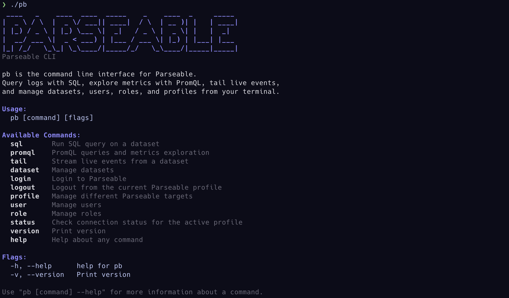
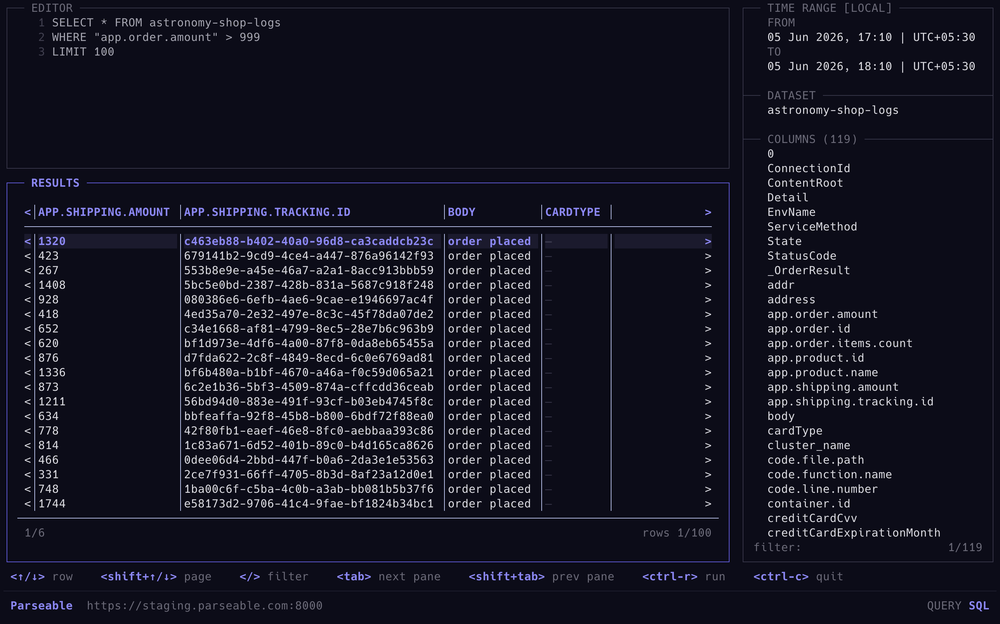
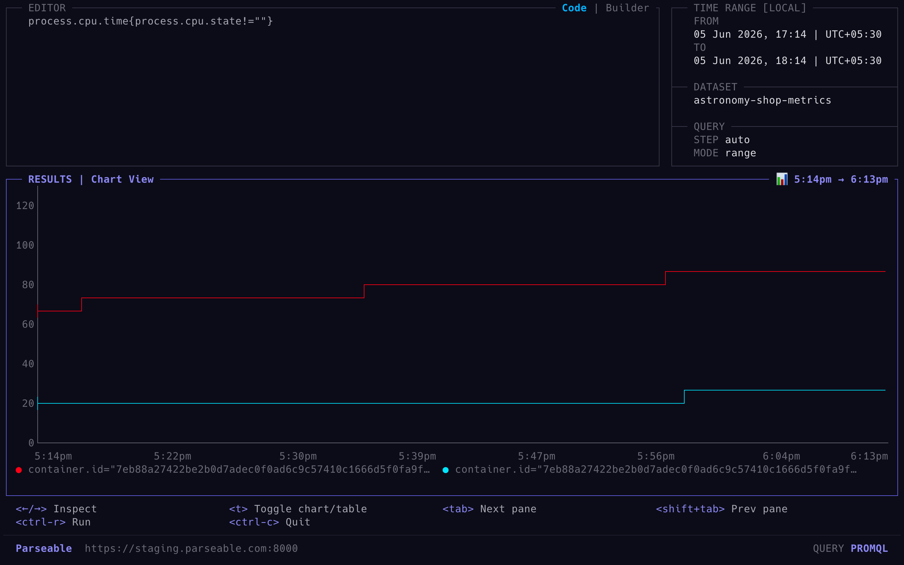

# pb — Parseable CLI

<p>
<a href="https://github.com/parseablehq/pb/actions/workflows/build.yaml"></a>
<a href="https://go.dev/"></a>
<a href="LICENSE"></a>
<a href="https://github.com/parseablehq/pb/releases/latest"></a>
</p>



Parseable in your terminal. `pb` lets you query logs with SQL, run PromQL against metrics streams, tail live events, and manage Parseable datasets, users, roles, and profiles without leaving your shell.

Query production logs. Explore metrics. Stream new events. Save repeatable investigations. Move between local, staging, and production Parseable instances with named profiles.

*"Don't guess. Query the logs."*

## What is pb?

`pb` is the command line interface for [Parseable](https://github.com/parseablehq/parseable). It gives operators and developers a fast terminal workflow for:

- SQL log queries with text or JSON output
- Interactive Bubble Tea table views for large result sets
- PromQL range and instant queries
- Metrics metadata exploration: labels, series, cardinality, and TSDB stats
- Live event tailing from Parseable datasets
- Dataset, user, role, and profile management
- Human-readable terminal output and structured JSON for automation and agents

## Quick Start

```sh
# Connect to a Parseable server
pb login

# Open the interactive SQL table view
pb sql run -i

# Open SQL with a pre-filled query
pb sql run "SELECT * FROM backend" --from=1h -i

# Open the interactive PromQL table view
pb promql run -i

# Open PromQL with a pre-filled query
pb promql run "rate(http_requests_total[5m])" --dataset otel_metrics --from=1h -i

# Stream live events
pb tail backend
```

## Installation

**Quick install (Linux/macOS):**

```sh
curl -fsSL https://raw.githubusercontent.com/parseablehq/pb/main/scripts/install.sh | sh
```

Downloads the latest release, verifies the SHA-256 checksum, and installs to
`~/.local/bin`. Override the location with `INSTALL_DIR`:

```sh
curl -fsSL https://raw.githubusercontent.com/parseablehq/pb/main/scripts/install.sh | INSTALL_DIR=/usr/local/bin sh
```

**Quick install (Windows PowerShell):**

```powershell
powershell -ExecutionPolicy Bypass -c "irm https://raw.githubusercontent.com/parseablehq/pb/main/scripts/install.ps1 | iex"
```

Downloads the latest release, verifies the SHA-256 checksum, installs to
`%USERPROFILE%\bin`, and adds that folder to your user `PATH`. Open a new
PowerShell window after installation.

**Homebrew (macOS and Linux):**

```bash
brew install parseablehq/tap/pb
```

> Use the full tap name above. `brew install pb` installs an unrelated Homebrew cask.

**Pre-built binary (Linux/macOS/Windows):**

Download the latest archive for your OS and architecture from the
[releases page](https://github.com/parseablehq/pb/releases/latest),
extract it, and move the binary to your `PATH`:

```bash
tar xzf pb_*.tar.gz
chmod +x pb && sudo mv pb /usr/local/bin/
```

Windows archives contain `pb.exe`; extract the `.zip` and move `pb.exe` to a
folder in your `PATH`.

Available archives:

| Platform | Archive |
|---|---|
| macOS Apple Silicon | `pb_<version>_darwin_arm64.tar.gz` |
| macOS Intel | `pb_<version>_darwin_amd64.tar.gz` |
| Linux x86 64-bit | `pb_<version>_linux_amd64.tar.gz` |
| Linux ARM 64-bit | `pb_<version>_linux_arm64.tar.gz` |
| Windows x86 64-bit | `pb_<version>_windows_amd64.zip` |
| Windows ARM 64-bit | `pb_<version>_windows_arm64.zip` |

On macOS, a manually downloaded binary may be blocked on first run. Allow it once with:

```bash
xattr -d com.apple.quarantine /usr/local/bin/pb
```

**Go install:**

```bash
go install github.com/parseablehq/pb@latest
```

**Verify:** `pb --help`

## Authentication

`pb` supports self-hosted Parseable and Parseable Cloud. Authentication details
are stored in a named local profile so subsequent commands can connect without
asking for credentials again.

**Interactive login wizard:**

```bash
pb login
```

Choose one of the following targets in the wizard:

- **Self-hosted:** enter the Parseable URL and authenticate with a username and
  password or an API key.
- **Parseable Cloud:** authenticate through the browser or with a Parseable
  Cloud API key. The selected workspace is saved as a local profile.

**Add a self-hosted profile without prompts:**

```bash
pb profile add local http://localhost:8000 admin admin
pb profile add local-key http://localhost:8000 --api-key psk_xxx
```

**Add a Parseable Cloud API-key profile without prompts:**

```bash
pb cloud profile add --api-key psk_xxx --name production
```

For non-interactive agent or CI authentication, load the API key from the
platform's secret store and request structured output:

```bash
# Self-hosted
pb profile add agent https://parseable.example.com \
  --api-key "$PARSEABLE_API_KEY" -o json

# Parseable Cloud
pb cloud profile add --name agent \
  --api-key "$PARSEABLE_CLOUD_API_KEY" -o json
```

The saved profile can then be used by subsequent `pb` commands without an
interactive login prompt. Do not commit API keys to source control.

> ⚠️ **Warning for agent access:** Create a dedicated read-only API key or role
> with the minimum permissions required for queries and metadata reads. Do not
> give an agent an administrator or shared human credential. Read-only access
> must be enforced by Parseable on the server.

**Manage profiles:**

```bash
pb profile list
pb profile default prod
pb profile update prod https://new-parseable.example.com
pb profile remove prod
pb logout
```

Config file location:

| Platform | Path |
|---|---|
| macOS/Linux | `~/.config/pb/config.toml` |
| Windows | `%AppData%\pb\config.toml` |

**Verify connection:** `pb status`

## See It in Action

**Open the interactive SQL TUI:**

```sh
pb sql run -i
```

Start with a pre-filled query:

```sh
pb sql run "SELECT * FROM backend-shop WHERE order.amount > 999 LIMIT 5" --from=1h -i
```


**Run SQL without the TUI:**

```sh
pb sql run "SELECT * FROM backend WHERE status >= 500 LIMIT 5" --from=1h
```

**Open the interactive PromQL TUI:**

```sh
pb promql run -i
```

Start with a pre-filled query:

```sh
pb promql run "process.cpu.time{process.cpu.state!=""}" --dataset astronomy-shop-metrics --from=1h -i
```



**Run PromQL without the TUI:**

```sh
pb promql run "sum(rate(http_requests_total[5m]))" --dataset otel_metrics --from=1h
```

**Stream live events:**

```sh
pb tail backend | jq 'select(.level == "error")'
```

`pb tail` uses gRPC. Make sure the server's gRPC port is reachable in addition to the main HTTP port.

## SQL Workflows

Interactive mode is the primary SQL workflow:

```bash
pb sql run -i
pb sql run "SELECT * FROM backend" --from=1h -i
```

Panels: Query, Time Range, Dataset, Columns, and Table. Navigate with Tab and Shift+Tab.

```bash
pb sql run "SELECT * FROM backend" --from=10m --to=now
pb sql run "SELECT * FROM backend" --from=1h --output json | jq .
pb sql run "SELECT * FROM backend WHERE status = 500" --from=1h --save-as=server-errors
pb sql save "SELECT * FROM backend WHERE status = 500" --name=server-errors
pb sql list
```

OTel fields with dots like `service.name` and `http.status_code` work directly in queries without manual quoting.

## PromQL Workflows

Interactive mode is the primary PromQL workflow:

```bash
pb promql run -i
pb promql run "http_requests_total" --dataset otel_metrics --from=1h -i
```

Panels: Dataset, Query, Time, Step, and Table. Press Space on the Step panel to toggle between range and instant mode.

```bash
pb promql run "rate(http_requests_total[5m])" --dataset otel_metrics --from=1h --step=1m
pb promql run "up" --dataset otel_metrics --instant
pb promql run "http_requests_total" --dataset otel_metrics --output json
```

Explore labels and series:

```bash
pb promql labels --dataset otel_metrics
pb promql label-values job --dataset otel_metrics
pb promql series --match 'http_requests_total{job="api"}' --dataset otel_metrics
```

Cardinality and TSDB analysis:

```bash
pb promql cardinality label-names --dataset otel_metrics
pb promql cardinality label-values --dataset otel_metrics --label job
pb promql cardinality active-series --dataset otel_metrics
pb promql tsdb --dataset otel_metrics
pb promql active-queries
```

## Manage Parseable

```bash
# Datasets
pb dataset list
pb dataset info <dataset>
pb dataset add <dataset>
pb dataset remove <dataset>

# Users
pb user list
pb user add <user> --role <role>
pb user set-role <user> <role1>,<role2>
pb user remove <user>

# Roles
pb role list
pb role add <role>
pb role remove <role>

# Server status and versions
pb status
pb version
```

Short aliases are available for common commands:

```bash
pb sql ls
pb dataset ls
pb dataset rm <dataset>
pb dataset stat <dataset>
pb profile ls
pb profile rm <profile>
pb profile set-url <profile> <url>
pb user ls
pb user rm <user>
pb role ls
pb role rm <role>
pb promql ps
```

## Command Groups

| Area | Commands | What you can do |
|---|---|---|
| Query logs | `pb sql` | Run SQL, save queries, open interactive result tables |
| Query metrics | `pb promql` | Run PromQL, inspect labels/series/cardinality |
| Stream events | `pb tail` | Watch new events from a dataset |
| Datasets | `pb dataset` | List, inspect, create, and remove datasets |
| Profiles | `pb login`, `pb cloud profile`, `pb profile`, `pb logout` | Manage self-hosted and Parseable Cloud connections |
| Access control | `pb user`, `pb role` | Manage users and roles |
| System | `pb status`, `pb version` | Check connectivity and versions |

## Automation

Commands print human-readable text by default. Commands that support
`-o json` return structured output for scripts, CI, and agent workflows:

```bash
pb status -o json
pb profile list -o json
pb dataset list -o json
pb sql run "SELECT count(*) FROM backend" --from=1h --output json
pb promql run "up" --dataset otel_metrics --instant --output json
```

Use `pb <command> --help` to check output support. For automation, omit `-i`
so SQL and PromQL commands print output instead of opening the terminal UI.

## Documentation

| Topic | Description |
|---|---|
| [Parseable](https://github.com/parseablehq/parseable) | Parseable server repository |
| [Releases](https://github.com/parseablehq/pb/releases/latest) | Download pre-built binaries |
| `pb --help` | List command groups |
| `pb <command> --help` | Command-specific help |

## Contributing

See the [contributing guide](CONTRIBUTING.md).

## License

AGPL-3.0 — see [LICENSE](LICENSE).
